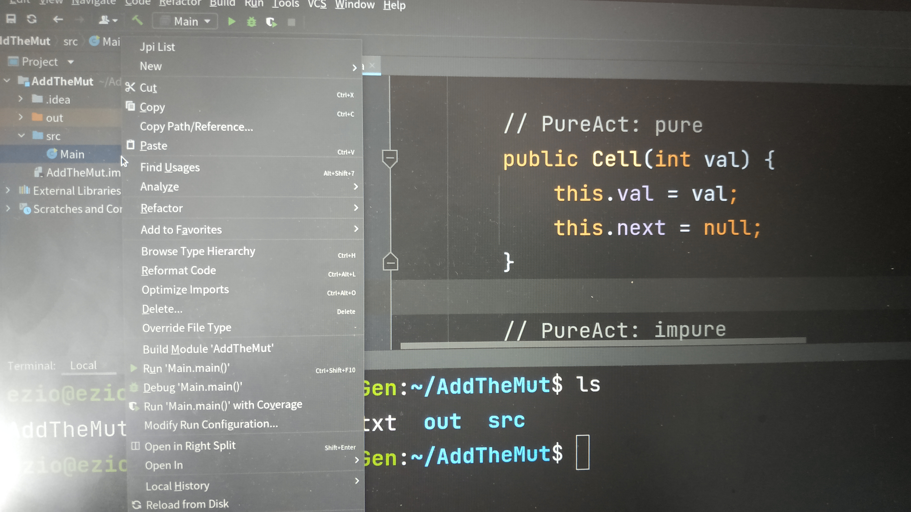

##Jpi 插件使用说明

0. 确定 intellij IDEA 版本为 2021.2 或之前版本。

1. 选择从磁盘安装插件文件 `jpi-1.0-SNAPSHOT.jar`

安装后重启IDE

2. 从IDE打开工程，选择工程下目标 java 文件，右键选择 `Jpi List`

3. IDE弹出分析成功通知，

等待片刻或从磁盘刷新工程目录后，工程目录下 `jpi-output.txt` 文件为分析结果。

